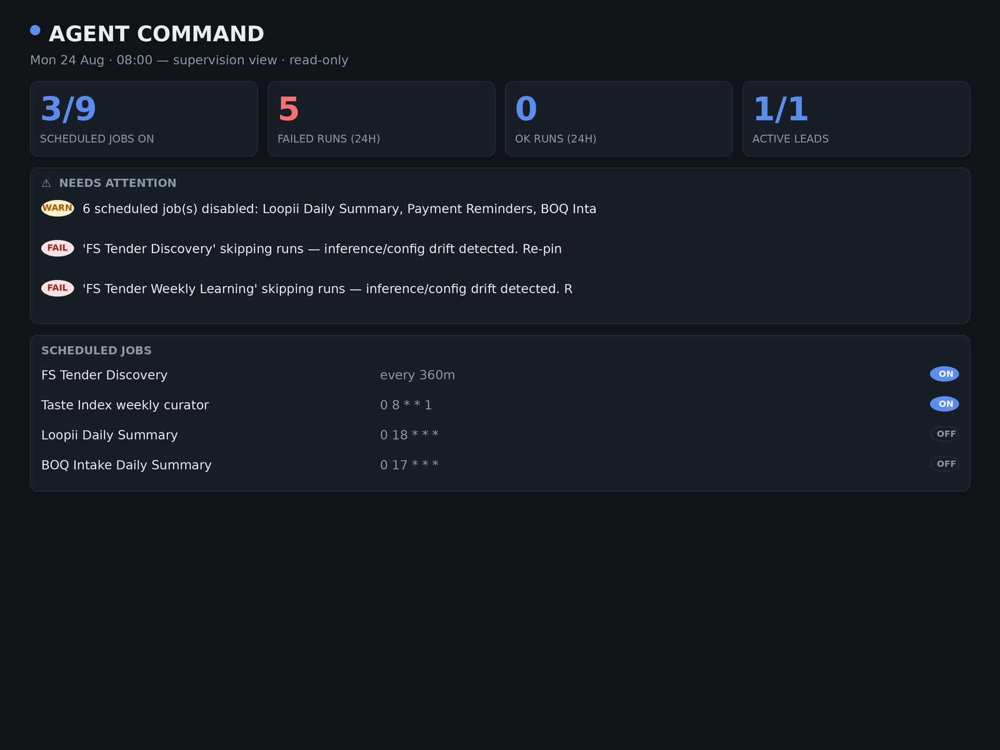

<div align="center">

# agentscope

**One clean screen for your AI agent crew.**
*Your agents worked all night. Is anything off?*

[Live site](https://agentscope-liard.vercel.app) · [Interactive demo](https://agentscope-liard.vercel.app/demo.html) · [Get started](#quick-start) · [MIT licensed](LICENSE)

</div>

---

A scan-first, supervision-only dashboard for people running multi-tool agent crews (Hermes Agent, cron-driven jobs, scheduled workflows). It renders one self-contained HTML page that answers a single question every morning:

> **"Is anything off?"**

Not an orchestrator. Not distributed tracing. A supervision layer.



## Why

Agent observability platforms (LangSmith, Langfuse, Braintrust) are built for ML engineers reading traces. When your *agent crew* is doing the work — scheduled jobs, campaigns, tool calls around the clock — the human need is different:

- Are my scheduled jobs **actually running**? (Silent config-drift skips and accidentally-disabled jobs are the #1 failure mode in practice.)
- What did my agents **already do**?
- Is anything off?

The interface inverts: fewer buttons, more signal. agentscope has zero controls. It's read-only by design.

## What it caught on day one

Two production jobs had been silently skipping every run for days: their inference config had drifted from the global environment, and the scheduler skipped them "to prevent unintended spend" — with no error surfacing anywhere. The dashboard's first render flagged both as FAIL with the exact fix hint. Fixed in two minutes.

That's the whole thesis: supervision surfaces what logs hide.

## Panels

| Panel | Answers |
|---|---|
| KPI row | Jobs on/total, failed runs 24h, OK runs 24h, active items |
| ⚠ Needs attention | Anomalies ONLY — quiet when healthy. Config-drift skips, auth failures (401/403), repeat failures, disabled jobs |
| Scheduled jobs | Every job with ON/OFF pill and cadence |
| Recent agent actions | Status feed with truncated error reasons |
| Sessions sparkline | Activity per day |

## Quick start

```bash
# auto-detects Hermes Agent layout (~/.hermes/)
python3 generate.py -o dashboard.html

# or point it at your own stack
python3 generate.py --config myconfig.json -o dashboard.html
```

Open `dashboard.html` in any browser. Done.

Requirements: Python 3.8+, stdlib only. Zero dependencies.

### Daily digest (optional)

Wire `generate.py` into any scheduler and have its printed summary sent to yourself (WhatsApp/Telegram/email). Example Hermes prompt: *"Run generate.py, turn the output into a <200-word morning digest."*

## Configuration

Copy `config.example.json`:

| Key | Purpose |
|---|---|
| `title`, `footer`, `theme` | Branding; `"dark"` or `"light"` |
| `sources.cron_jobs_glob` | Glob for job-definition JSON files (`name`, `schedule.display`, `enabled`) |
| `sources.executions_db` | SQLite with an `executions` table (`job_id`, `status`, `started_at`, `error`) |
| `sources.sessions_dir` | Directory of session files (activity counted by mtime) |
| `sources.leads_db` + `leads_query` | Optional generic counter: `[total_sql, active_sql]` |
| `session_days`, `max_actions` | Display tuning |
| `group_by` | `"none"` or `"group"` — group jobs by their group/project field |
| `compact` | `true` for compact density |
| `never_run_grace_hours` | Grace period before an explicitly dated, enabled job with no runs is flagged |
| `ack_db` | SQLite file holding the `acks(key, ts)` table for acknowledged anomalies |
| `sources.mcp_jsonl` | Optional JSONL of MCP/tool calls (`tool`, `ts`, `ok`) → per-tool success panel |

Any source may be `null` to skip it. Job definitions can optionally provide `required: false` for intentionally disabled jobs and `created_at` for reliable never-run detection. Timestamp parsing accepts timezone-aware ISO-8601 values and normalizes them before comparisons. The anomaly logic lives in `anomalies()` — extend the signature list for your own stack's failure modes.

## Scope

**In:** supervision of scheduled agent work, anomaly surfacing, one-page scanning.
**Out:** orchestration, deep tracing, multi-user permissions, automatic fixing. This is a supervision layer, not a control plane.

## Product direction

AgentScope stays deliberately focused on supervision rather than becoming an orchestration or tracing platform. The current source model is intentionally file/database based so a generated dashboard can remain self-contained and local.

The next expansion points are additive: more source adapters, richer cost/usage signals, and framework-specific anomaly rule packs. Hosted multi-source operation is deliberately not required for the core product.

## Changelog

### v0.6 — Product surface & reliability pass

- Rebuilt the landing page around the supervision thesis and added a clearly labelled interactive demo.
- Added responsive demo states for desktop and mobile, including 24h/7d activity filtering.
- Fixed the deployed landing screenshot asset path so the preview is served from the Vercel output.
- Hardened SQLite execution parsing when optional columns are absent.
- Corrected success-rate sampling to use the most recent execution rows.
- Corrected failure-streak detection so older failures do not remain flagged after a successful run.
- Added regression tests for core generator behavior.


### v0.5 — Success indicators, sharing, MCP awareness

- **Agent-success indicators**: jobs with 3+ recorded runs show a health chip (e.g. `92% of 12`) — green ≥80%, amber ≥50%, red below
- **Copy status summary**: one click copies a clean text summary (KPIs + anomalies) for pasting into chat/email — a share action, not an operational control
- **MCP / tool-call panel**: point `sources.mcp_jsonl` at a JSONL of tool calls (`{"tool","ts","ok"}`) and get per-tool success rates for the top 8 tools by volume; panel stays hidden when no data

### v0.4 — Multi-source & usability

- **Acknowledge anomalies**: "Got it" button marks an item as seen — it dims locally and stays hidden until it changes (localStorage-persisted view state; the `acks` SQLite table remains authoritative for programmatic use)
- **Job grouping**: set `"group_by": "group"` in config to group jobs by their `group`/`project` field with per-group ON counts
- **Compact density**: set `"compact": true` for tighter rows and panels
- **Group capture**: job definitions may carry `group` or `project` fields

### v0.3 — Core supervision upgrade

- **Smarter Needs Attention**: drift detection via `drift_skip` marker + skip phrasing; per-job failure streaks ("failed 3x in a row — likely broken"); auth failures called out explicitly
- **Human-readable outcomes**: raw errors replaced with short reasons — "Skipped – inference config drifted", "Failed – rate limited", "Failed – credentials rejected", "Completed". Graceful fallback to first sentence when no pattern matches
- **Visual hierarchy**: Needs Attention panel gets accent border + tint when problems exist; slim/quiet "all clear" state when healthy. Better mobile spacing and row padding
- **Relative timestamps**: "2h ago", "yesterday", "3d ago" throughout
- **Time filtering**: Last 24h / Last 7 days view-only chips (client-side, zero operational control)

### v0.2
- Dark + light themes; landing page; README rewrite; marketing screenshot

### v0.1
- Initial release: auto-detect Hermes layout, config-driven sources, anomaly panel

## License

MIT

### Verification gate

Core generator changes are covered by the repository regression suite in `.github/workflows/test.yml`.
